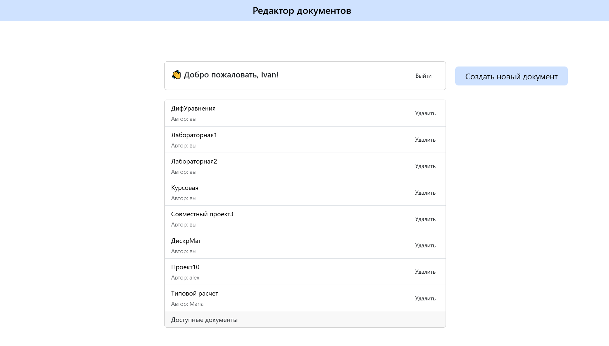

# LaTeX Collaborative Editor (дипломный проект бакалавра)

Веб-приложение для совместной работы с LaTeX-документами.  
Реализует одновременное редактирование, ведение истории изменений на основе Git и компиляцию в PDF через Docker.

## Зачем это нужно

Большинство онлайн-редакторов LaTeX имеют ограничения: урезанную историю правок, лимит на количество участников или платный доступ.  
Это приложение создаёт бесплатную альтернативу для командной работы над техническими и научными текстами.

## Основные возможности

- Многопользовательское редактирование LaTeX-документов
- Работа с ветками и история изменений на основе JGit
- Слияние правок в основную версию без конфликтов
- Компиляция LaTeX в PDF внутри Docker-контейнера
- Просмотр результатов компиляции в интерфейсе
- Авторизация, список документов, разграничение доступа

## Технологии

- **Backend:** Java, Spring Boot, Hibernate, JGit  
- **БД:** PostgreSQL  
- **Frontend:** Nuxt 3 (Vue.js)  
- **Контейнеризация:** Docker, TeX Live

## Главная страница редактора (список документов)

После авторизации пользователь попадает на главную страницу редактора. Здесь отображаются все документы, с которыми он может работать: его собственные и те, куда его пригласили другие пользователи. У каждого документа указано, кто автор. Можно выбрать любой и продолжить редактирование, а если нужно создать новый — достаточно нажать на кнопку «Создать новый документ».

